# WS Advance AI Messenger - Free

AI-assisted WhatsApp business messenger and desktop CRM built with React, Electron, Baileys, and local-first storage.

## Highlights

- WhatsApp-style inbox with contact, message, and conversation management
- AI auto-reply and outreach support through `electron/bridge/ai.js`
- Local Ollama support through `http://localhost:11434`
- Broadcast, quick send, templates, reminders, orders, reports, and analytics
- Local SQLite-style database layer through SQL.js
- Electron desktop build setup with Vite and Tailwind CSS
- Documentation for product overview, architecture, setup, privacy, API, and troubleshooting

## AI Agent

The AI agent code is included in `electron/bridge/ai.js`.

Supported backends:

- Ollama local models
- LM Studio, Jan AI, and LocalAI
- Pollinations AI as a free cloud fallback
- DuckDuckGo search helper for live web context

For Ollama:

```bash
ollama pull llama3.2
ollama serve
```

SYNCERA detects Ollama at `http://localhost:11434` and can use the available local models for AI replies.

## Calendar Proof Video

This demo shows the WhatsApp chat flow creating/saving a calendar event inside SYNCERA:

[Watch the calendar proof demo](docs/videos/calendar-chat-proof-demo.mp4)

## Screenshots

Customer names, phone numbers, and chat details are redacted in public screenshots.

| Dashboard | Chats | Quick Send |
| --- | --- | --- |
| 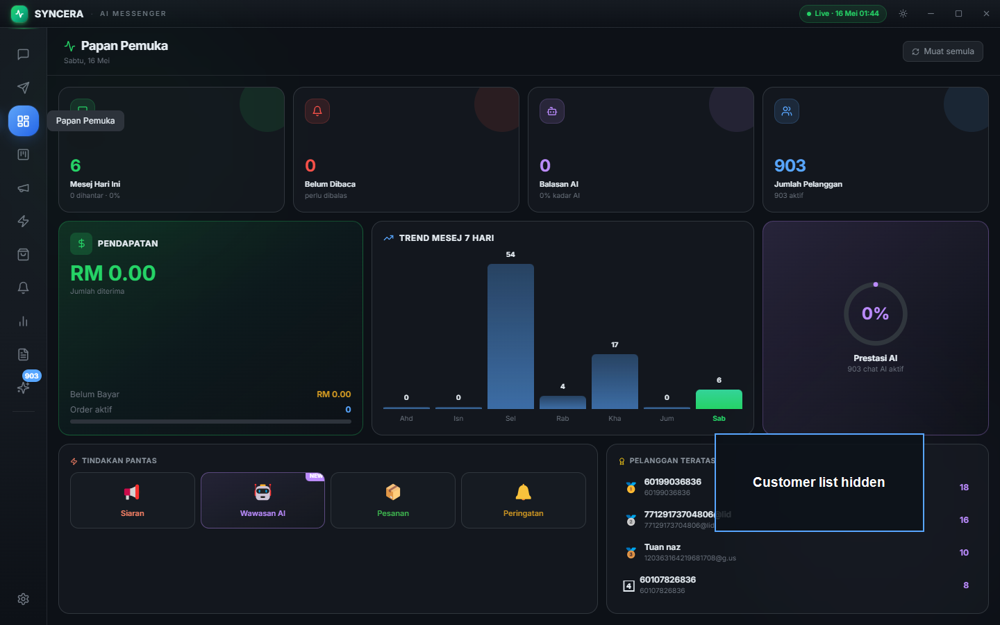 | 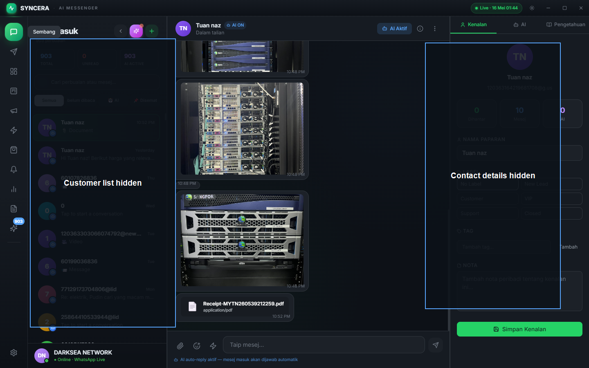 | 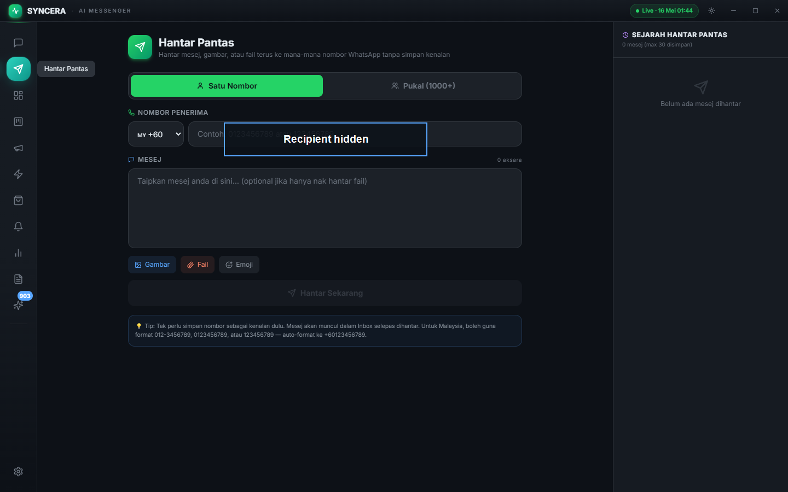 |

| Broadcast | Templates | Orders |
| --- | --- | --- |
| 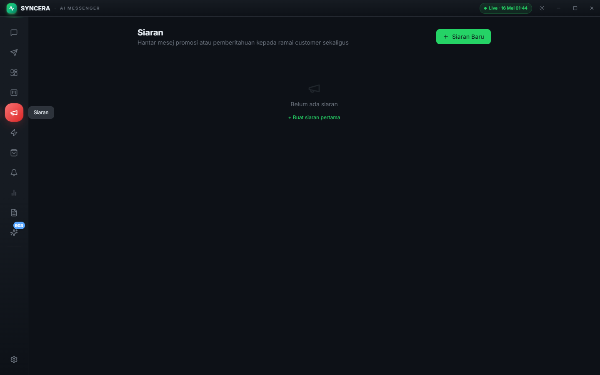 | 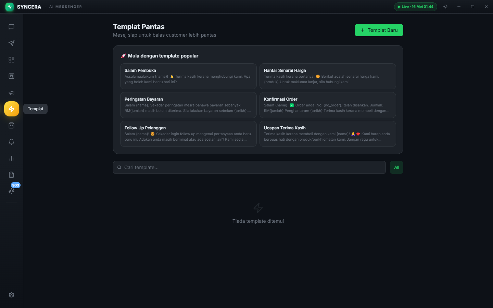 | 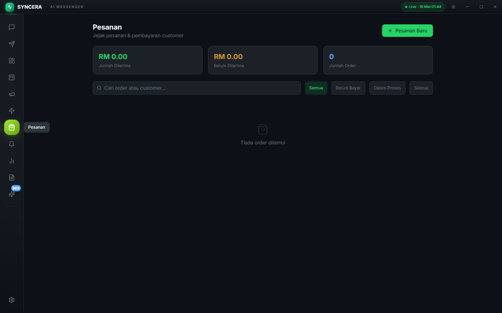 |

| Pipeline | Analytics | Reports |
| --- | --- | --- |
| 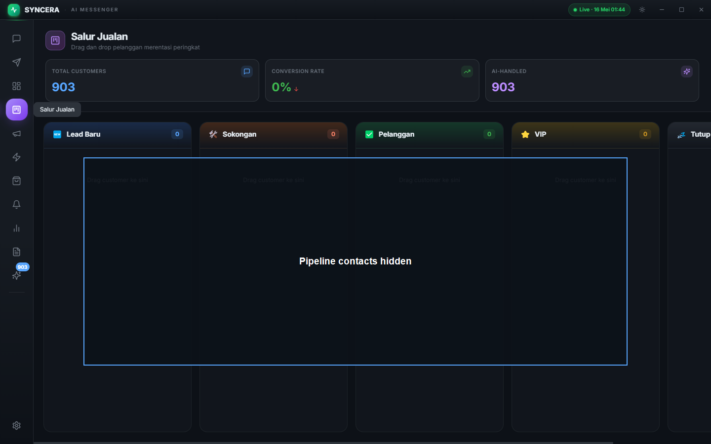 | 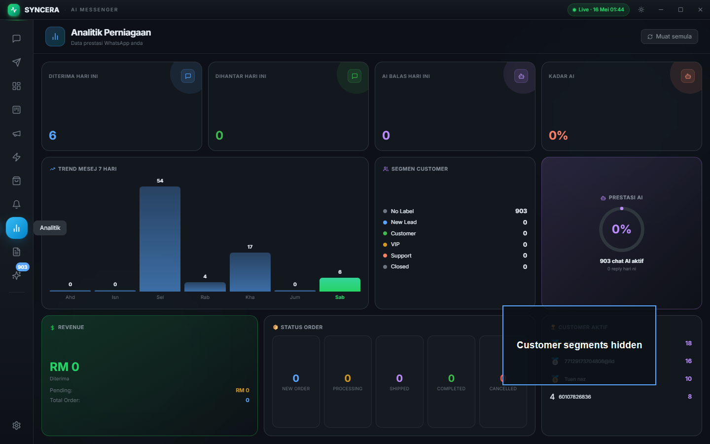 | 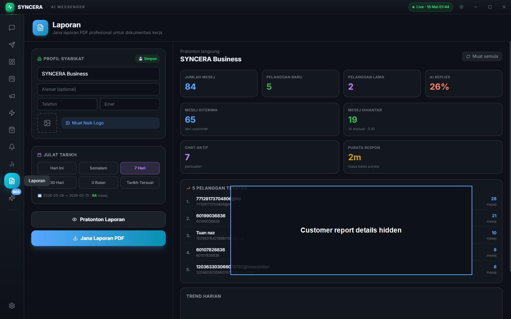 |

| Insights | Reminders | Main View |
| --- | --- | --- |
| 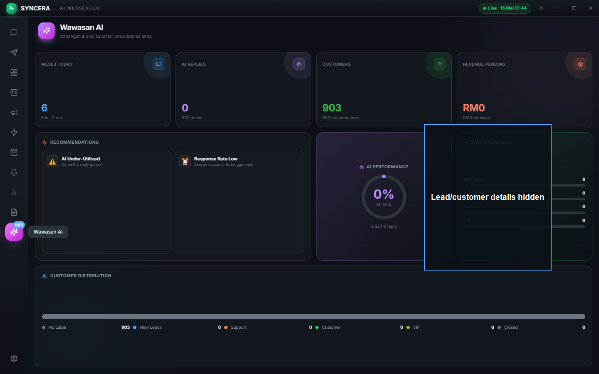 | 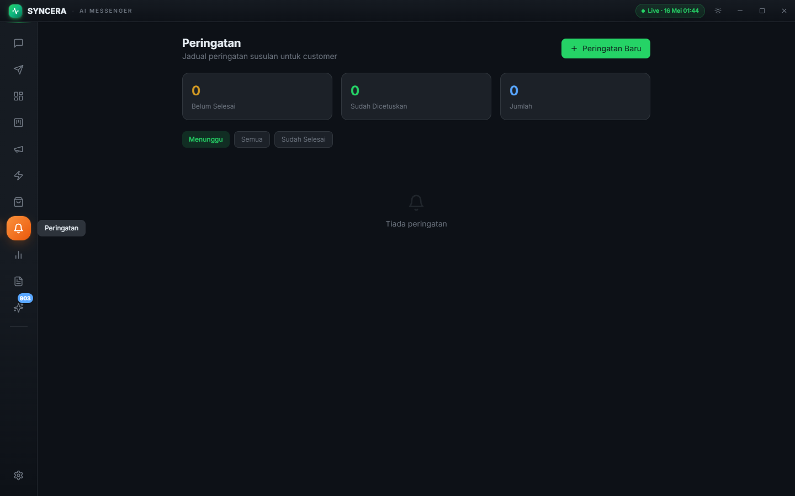 | 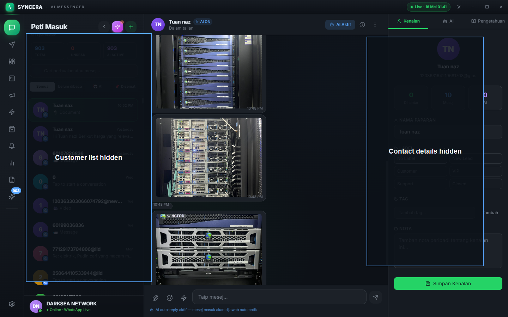 |

## Privacy Note

This public repository excludes private customer databases, WhatsApp auth sessions, local database files, build outputs, installers, logs, spreadsheets, personal import scripts, and unredacted screenshots. The calendar proof video is included intentionally to show the chat-to-calendar workflow.

## Getting Started

```bash
npm install
npm run dev
```

## Build

```bash
npm run build
```

## Project Structure

```text
src/                 React UI
electron/            Electron main process and bridge modules
electron/bridge/ai.js AI response and outreach logic
docs/                Product and technical documentation
public/              App icons and static assets
```

## Owner

Created by Nazrin Zainal - MYS.
